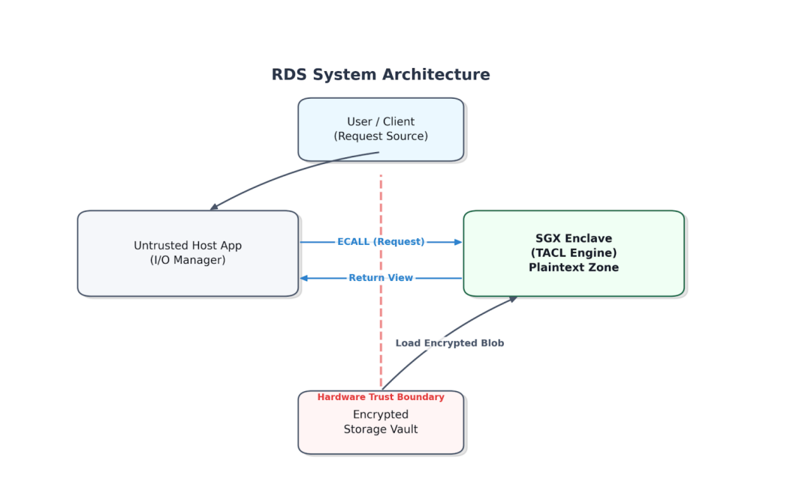
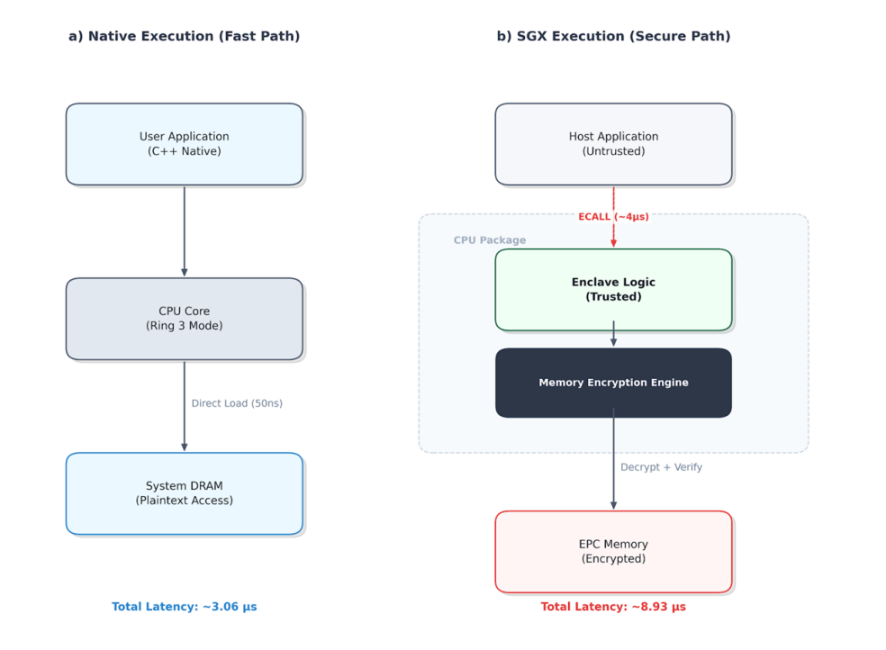

# Runtime Data Shadowing (RDS) via Intel SGX

> [cite_start]**Official Code Repository for "Runtime Data Shadowing: A Trusted Execution Environment (TEE) Approach for Secure Medical Data Sharing"** *(Currently Under Review: 6th International Conference on Emerging Trends and Technologies on Intelligent Systems - ETTIS 2026, Springer)*[cite: 956].

## 💡 TL;DR
[cite_start]This project implements Runtime Data Shadowing (RDS), a computing-layered framework that uses Role-Based Access Control (RBAC)-enabled Trusted Execution Environments (TEEs) to securely share medical records[cite: 774]. [cite_start]By design, the RDS architecture excludes the host Operating System (OS) and the hypervisor from the Trusted Computing Base (TCB)[cite: 775]. [cite_start]All plaintext data resides within the Enclave Page Cache (EPC)-enabled memory devices [cite: 776][cite_start], protected in DRAM via the Memory Encryption Engine (MEE) using AES-128-GCM[cite: 777].

## 📊 Key Results & Hardware Benchmarks
[cite_start]We operate at a strict $O(1)$ per-record projection granularity [cite: 793][cite_start], effectively avoiding the non-deterministic state synchronization delays typical in full enclave-resident databases[cite: 845].

* [cite_start]**Latency:** Deterministic latency of **8.93 µs** ($\sigma$ = **0.12 µs**, $P_{99}$ = **9.22 µs**)[cite: 778].
* [cite_start]**Throughput:** Maintained an average throughput of **112,046 Ops/sec** [cite: 880] [cite_start]across 100 endurance trials[cite: 881].
* [cite_start]**Overhead:** Represents a **2.9x** architectural execution penalty compared to running the code unprotected[cite: 778].
* [cite_start]**Paging Cliff:** Identified a critical **15x** latency degradation (> **140 µs**) triggered systematically when crossing the **128MB** EPC limit[cite: 891, 892].

## 🏗️ Architecture Overview
[cite_start]The system relies on an interface boundary (`Enclave.edl`) that mandates copying the entire input buffer prior to applying any security checks[cite: 864]. [cite_start]This approach fully eliminates Time-of-Check to Time-of-Use (TOCTOU) vulnerabilities, meaning a malicious OS cannot mutate the memory content asynchronously[cite: 865].

[cite_start]*(The TACL limits plaintext manifestation to the hardware-isolated EPC [cite: 856])*

[cite_start]*(Execution path comparison detailing the ~4µs ECALL and MEE overhead [cite: 858])*

## 📂 Repository Structure
[cite_start]The current implementation contains roughly **3,400** lines of C/C++ code[cite: 859].

* [cite_start]`/host`: Untrusted host application (~1,200 lines of code) managing thread pooling and loading a database[cite: 860].
* [cite_start]`/enclave`: The Trusted Access Computation Layer (TACL) core (~2,200 lines of code)[cite: 861]. [cite_start]Integrates a static-linked Intel IPP Cryptography library for secure AES-128-GCM workloads[cite: 862].
* [cite_start]`/data`: Synthetic patient entries modeled on MIMIC-III layout patterns [cite: 869][cite_start], padded to 1024-byte blocks to align with standard HL7 FHIR Observation sizes[cite: 870].

## ⚙️ System Requirements & Reproduction
[cite_start]Evaluations were run on identical physical hardware[cite: 867]:

* [cite_start]**CPU:** Intel Core i5-8500 (Hexa-core, 3.00 GHz)[cite: 867].
* [cite_start]**Memory:** 8GB DDR4 with a 128MB EPC limit[cite: 868].
* [cite_start]**OS Kernel:** Ubuntu 20.04 LTS (5.4.0-150-generic)[cite: 868].
* [cite_start]**SDK:** Intel SGX Linux SDK v2.17[cite: 859].
* [cite_start]**Compiler:** gcc 9.4.0[cite: 859].

### Build Instructions
1. Ensure the Intel SGX SDK and SGX driver are correctly installed and sourced in your environment.
2. Clone this repository.
3. Execute `make` in the root directory to compile both the untrusted host and the trusted enclave objects.
4. Run the executable: `./rds_app`
